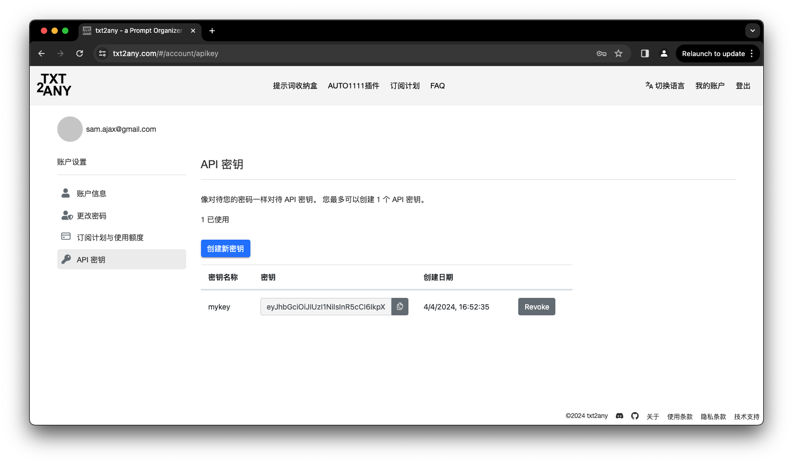

### [ [English README.md](README_en.md) ]

# ComfyUI-PromptOrganizer
此扩展插件协助 [Stable Diffusion ComfyUI](https://github.com/comfyanonymous/ComfyUI) 用户将生成图片保存到 [www.txt2any.com](https://www.txt2any.com).

# TL;DR txt2any 是什么
当AI生成的图片上传至 txt2any，服务器会处理并提取被 AUTO1111 或 ComfyUI 注入的元数据。利用它能使用户在不同的创作迭代之间将提示词进行逐字比较，将生成参数也进行逐个比对。这样能帮助用户更好的理解提示词增、删、改、排序、权重以及参数调整对输出质量的影响。用户也可以与其他创造者的作品进行比较学习。与此同时，用户还能获得一个云存储来暂存创作。免费的订阅计划将会一直免费。

## 如何安装

### 通过命令行安装

1. 在命令行中找到安装目录，进入 "custom_nodes" 子目录
2. 执行命令 `git clone https://github.com/txt2any/ComfyUI-PromptOrganizer`
3. 将 txt2any API 密钥保存到 txt2any.ini 文件中 (可跳过此步骤，在下一节中有详细说明)
4. 重新启动 ComfyUI

### 通过 ComfyUI Manager 安装

1. 您必须预先安装 ComfyUI Manager
2. 点击 "Manager" 弹出 "ComfyUI Manager Menu" 菜单对话框
3. 点击 "Install via Git URL"
4. 复制粘贴 `https://github.com/txt2any/ComfyUI-PromptOrganizer` 至对话框
5. 点击 "OK" 确定并重启 ComfyUI

## 如何使用 txt2any

### 设置

从 [www.txt2any.com](https://www.txt2any.com) 的用户账户中生成 API 密钥并将该密钥保存至 txt2any.ini 文件内。删除 txt2any.ini 文件内的所有已有内容，并将该密钥粘贴到 txt2any.ini 中。

### 如何使用 txt2any 的“提示词收纳盒”功能

在现有的工作流最后的输出节点，用 "Save image to txt2any" 节点替换 "Save Image" 节点。在输出区域会出现一个 "View in txt2any" 的按钮。执行生成队列，等待完成后点击此按钮将会弹出该图片的预览和详细生成信息。点击空白处可以关闭预览并与其他图片进行提示词和生成参数的比较。

