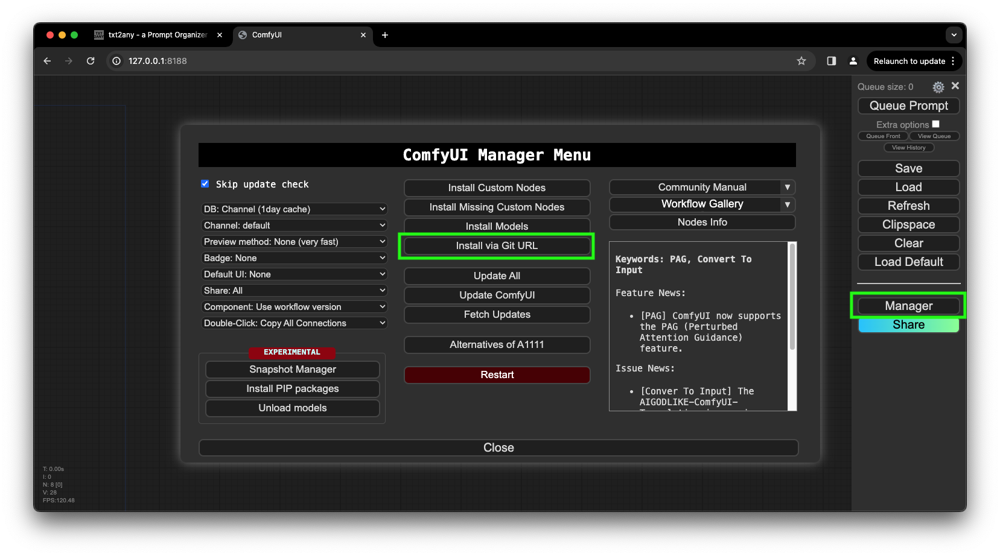
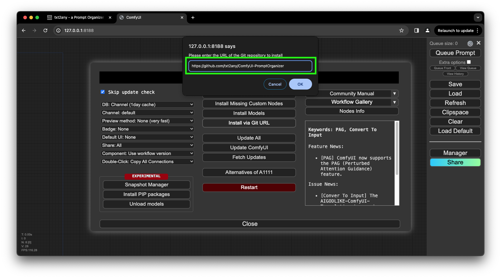
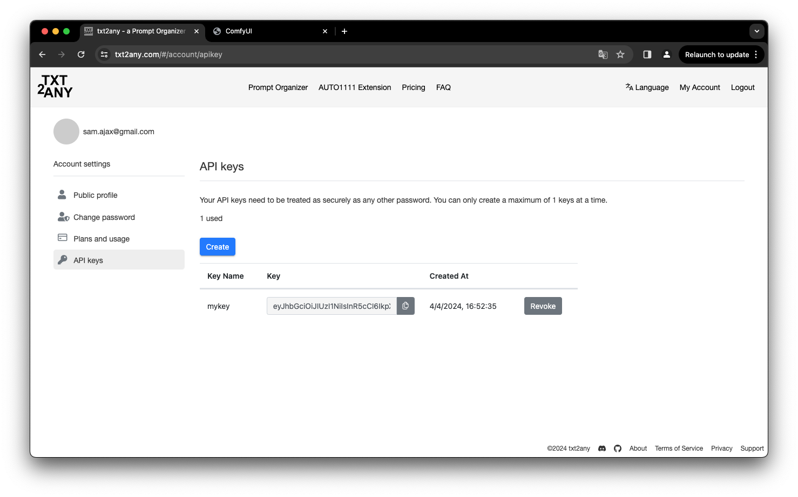
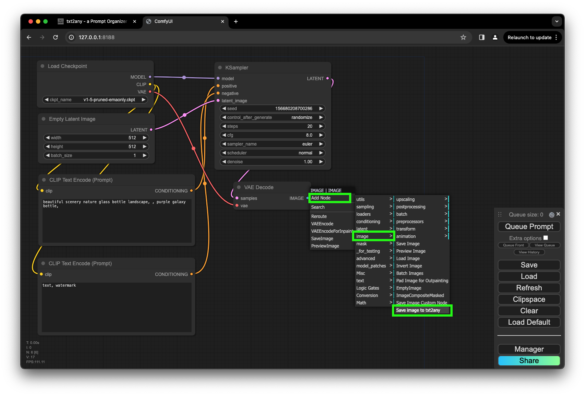
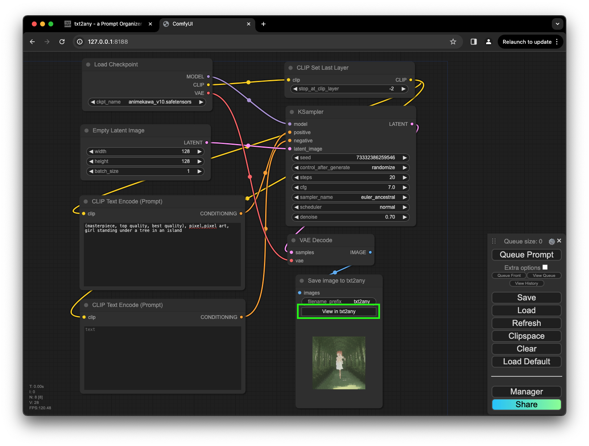

# ComfyUI-PromptOrganizer
This is a custom node for [Stable Diffusion ComfyUI](https://github.com/comfyanonymous/ComfyUI) that automatically saves your AI-generated images specifically to [www.txt2any.com](https://www.txt2any.com).

# TL;DR What's txt2any
When you upload AI-generated images to txt2any, the server processes and extracts the metadata injected by AUTO1111 or ComfyUI. It allows you to compare prompt text word by word and generation data parameter by parameter so that you can understand the significance of each text or parameter in order to achieve a better result. Additionally, you will have access to cloud storage. The free tier will always remain free.

## Installation

### Install via terminal

1. Open installation directory under terminal, enter "custom_nodes" sub-directory
2. Execute the command `git clone https://github.com/txt2any/ComfyUI-PromptOrganizer`
3. Save txt2any API Key into the file `txt2any.ini` (You can skip this step and it is explained in the next section)
4. Restart ComfyUI

### Install via ComfyUI Manager

1. You must have ComfyUI Manager installed first
2. Click on "Manager" button to bring up "ComfyUI Manager Menu" dialog
3. Click on "Install via Git URL"
4. Copy and paste `https://github.com/txt2any/ComfyUI-PromptOrganizer` to the input field
5. Click on the "OK" button and restart ComfyUI

## Getting started

### Configuration

Generate an API Key from your [www.txt2any.com](https://www.txt2any.com) account and save it in the file `txt2any.ini`.

### How to use the txt2any Prompt Organizer

At the end of your workflow, Use "Save image to txt2any" node to replace "Save Image" node. In the output area there is a "View in txt2any" button. Execute your workflow. After the generation finishes click on the "View in txt2any" button it will take you to the image in the cloud and display all the generation data. More features are available such as Prompt Comparison and Generation Data Comparison.

